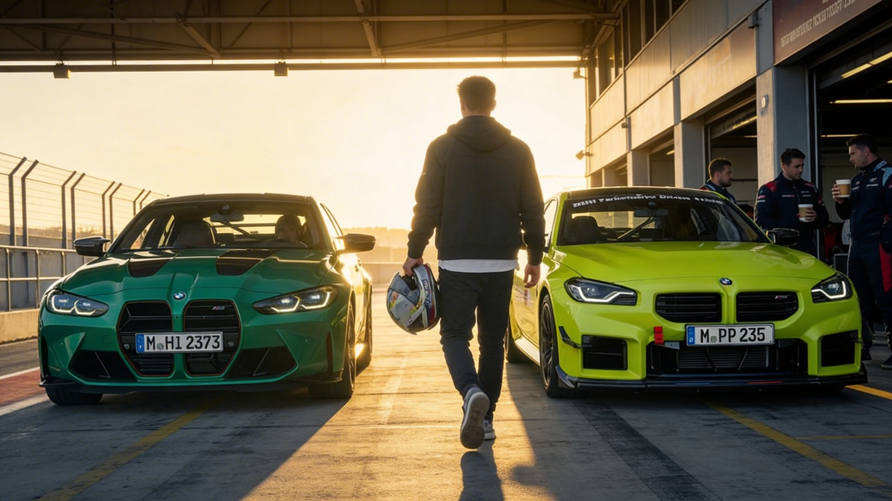

# Coffee Cup Background Resolution Benchmark

AI image generators put all their effort into the hero subject and *give up* on background objects. This benchmark measures exactly that.

Generate a normal scene — an office, a cafe, a pit lane — where someone in the background is holding a coffee cup. Then measure whether the model actually resolved that cup into a coherent object or just painted a shapeless blob.

**Leaderboard:** [background-coffee-cups.github.io/coffee-cup-benchmark](https://background-coffee-cups.github.io/coffee-cup-benchmark/)

## The Problem



*SeedReam 4.5 rendering a BMW pit lane scene. The cars are flawless. The background coffee cups are shapeless blobs — no handles, no rims, no structure. The model allocated its entire detail budget to the hero subjects and gave up on the cups.*

This is not a cherry-picked failure. It happens consistently across models: the further an object is from the focal point, the less coherent it becomes. Coffee cups are the canary in the coal mine — they have specific structural features (handle, rim, cylindrical body) that are easy to verify and impossible to fake with a generic blur.

## What This Benchmark Tests

- **Does the model resolve background objects or just paint blobs?**
- **Is the detail consistent across depth?** (sharp text on soft cups = artifact)
- **Are structural features preserved?** (handle, rim, cylindrical shape)
- **Does the model understand depth-of-field?** (appropriate blur, not just low effort)

## Overview

This toolkit provides:
- **Multi-model detection** (YOLO + OWL-ViT) for robust cup identification
- **Background/foreground classification** based on spatial reasoning
- **7-metric quality evaluation** including sharpness-consistency detection
- **Leaderboard** with submission system for cross-model ranking

## Why Coffee Cups?

Coffee cups appear naturally in almost every indoor scene. They have distinctive structural features that are easy to evaluate programmatically: a handle, a rim, a cylindrical body, consistent surface texture. When a model "gives up" on a background cup, it's immediately visible — and measurable.

| What it reveals | Why it matters |
|-----------------|----------------|
| Background detail allocation | Models that only render hero subjects fail real-world use |
| Depth-of-field understanding | Appropriate blur vs low-effort smearing |
| Structural coherence at distance | Can the model maintain object identity in the periphery? |
| Sharpness consistency | Sharp fake text on soft cups = AI artifact |
| Scene composition fidelity | Product photography, film stills, editorial — all need consistent backgrounds |

## Installation

### Requirements
- Python 3.9+
- CUDA 11.8+ (recommended for GPU acceleration)
- 8GB+ RAM

### Setup

```bash
git clone https://github.com/Background-Coffee-Cups/coffee-cup-benchmark.git
cd coffee-cup-benchmark
python -m venv venv
source venv/bin/activate
pip install -r requirements.txt
```

Models download automatically on first run, or manually:
```bash
python -c "from ultralytics import YOLO; YOLO('yolov8x.pt')"
python -c "import clip; clip.load('ViT-B/32')"
```

## Quick Start

### Single Image Evaluation

```python
from src.benchmark import CoffeeCupBenchmark
import json

benchmark = CoffeeCupBenchmark()
result = benchmark.run_single_image("path/to/image.jpg", save_visualization=True)
print(json.dumps(result, indent=2))
```

### Batch Processing

```python
results = benchmark.run_batch("./generated_images/", output_file="results.json")
```

### Compare Models

```bash
python scripts/compare_models.py --models dalle3 midjourney stable_diffusion flux
```

### Submit to Leaderboard

```python
submission = benchmark.export_submission(results, model_name="my-model-v1")
# Upload via: python scripts/run_benchmark.py --submit --model "my-model-v1"
```

## Command Line

```bash
# Benchmark single image
python scripts/run_benchmark.py --image path/to/image.jpg --output result.json

# Batch benchmark
python scripts/run_benchmark.py --image-dir ./images/ --output batch_results.json

# Generate test prompts
python scripts/generate_prompts.py --output config/prompts.json --count 60

# Compare models
python scripts/compare_models.py --models dalle3 midjourney stable_diffusion

# Submit results to leaderboard
python scripts/run_benchmark.py --submit --model "model-name" --results batch_results.json
```

## Metrics

### Overall Quality (Weighted Average)
| Metric | Weight | Description |
|--------|--------|-------------|
| Semantic Quality | 25% | CLIP-based cup coherence |
| Visual Resolution | 20% | Sharpness and detail level |
| Detection Confidence | 15% | Detector certainty |
| Structural Quality | 15% | Cup-like features (rim, handle, proportions) |
| Artifact Score | 10% | Freedom from AI generation artifacts |
| Color Coherence | 8% | Realistic color distribution |
| Edge Quality | 7% | Clean vs mushy edges |

**Scale:** 0.0 - 1.0
- 0.8+ : Excellent
- 0.6-0.8: Good
- 0.4-0.6: Fair
- < 0.4 : Poor

## Output Files

- `benchmark_results.json` — Raw evaluation scores
- `*_annotated.jpg` — Images with detected cups highlighted (color-coded by quality)
- `benchmark_analysis.png` — 4-panel analysis (histogram, metrics, scatter, correlation)

## Configuration

Edit `config/benchmark_config.yaml`:

```yaml
detector:
  yolo_model: "yolov8x.pt"
  yolo_confidence: 0.15
  owl_model: "google/owlvit-base-patch32"
  owl_confidence: 0.15
  nms_threshold: 0.5

evaluator:
  clip_model: "ViT-B/32"
  device: "cuda"  # or "cpu" or "auto"

benchmark:
  save_visualizations: true
  visualization_dpi: 150
```

## Testing

```bash
pytest tests/
pytest tests/ --cov=src --cov-report=html
```

## Performance

On NVIDIA RTX 3090:
- Single image detection: ~2 seconds
- Single cup evaluation: ~0.5 seconds
- Batch of 100 images: ~5-7 minutes

## Contributing

Contributions welcome! Areas for improvement:
- Additional detection models (SAM, Grounding DINO)
- More quality metrics
- GPU optimization
- Support for video sequences
- Real-world cup dataset for validation

## License

MIT License - see [LICENSE](LICENSE)

## References

- [YOLOv8](https://github.com/ultralytics/ultralytics)
- [OWL-ViT](https://huggingface.co/google/owlvit-base-patch32)
- [CLIP](https://github.com/openai/CLIP)

---

**Made with coffee, for evaluating coffee in AI images** | [Background Coffee Cups](https://github.com/Background-Coffee-Cups)
